# Production-Vision-Inspection

Production-oriented vision inspection profolio project covering ROI preprocessing, anomaly detection, heatmap/overlay interpretation, operating-threshold tuning, drift monitoring, FastAPI serving, and an MFC demo client.

## 1. Project Overview

### 1-1. Problem

In manufacturing inspection systems, input image quality can vary because of changes in lighting, camera conditions, background, and production line status. When this happens, simple OK/NG classification alone is not enough for stable operation. It also becomes difficult to analyze the causes of false positives (FP) and false negatives (FN) and to determine appropriate follow-up actions.

### 1-2. Goal

The goal of this project is to build the following workflow from an operational manufacturing inspection perspective:

1. stably extract the inspection ROI from raw input images
2. standardize the input range based on the ROI
3. generate anomaly scores and heatmaps with an anomaly detection model
4. perform threshold-based decisions and FP/FN case analysis
5. define a structured JSON response format and practical extension points for inspection operation
6. organize the pipeline so that it can be extended to drift monitoring and retrain-trigger logic
7. expose the final inference flow through a FastAPI endpoint and an MFC demo client

## 2. Dataset

### 2-1. Dataset

- **VisA**
- Categories
  - `pcb4`
  - `cashew`

### 2-2. Why `pcb4` and `cashew`?

- **pcb4**  
  This category is closely aligned with manufacturing inspection scenarios, making it suitable for explaining ROI alignment, input standardization, and inspection-oriented anomaly detection workflow.

- **cashew**  
  This category has different shape and surface texture characteristics from `pcb4`, which makes it useful for comparing how the same preprocessing and anomaly detection pipeline behaves on a different type of object.

### 2-3. Data Split Summary

| Category | Normal | Anomaly |
| -------- | -----: | ------: |
| pcb4     |   1005 |     100 |
| cashew   |    500 |     100 |

## 3. Tech Stack

- Python
- OpenCV
- NumPy / Pandas / scikit-learn
- Lightweight PatchCore-style anomaly detection
- FastAPI
- MFC / C++

## 4. What This Project Shows

This project is intended to demonstrate the following capabilities in a workflow closer to real inspection operations:

- preprocessing design that reduces input variability by organizing the inspection ROI first
- interpretability through anomaly score, heatmap, and overlay outputs
- FP/FN analysis from an operational threshold perspective
- an operational structure that can be extended with drift monitoring, retrain-trigger logic, and future serving/UI integration

---

## 5. Current Baseline: ROI-only Preprocessing

### 5-1. Why ROI First?

Before comparing anomaly detection model performance, the first step is to standardize the input region that contains the inspection target.  
If too much background is included, the score distribution becomes unstable and the heatmap also becomes harder to interpret.

For this reason, this project first established an **ROI-only baseline**.

### 5-2. ROI Strategy

The current ROI is generated with the following procedure:

- estimate the background color from the image border
- compute both an AB-distance map and a LAB-distance map against the estimated background
- generate candidate foreground masks with thresholding and mask cleanup
- score the candidates with AB-priority and LAB-fallback logic
- select the final foreground mask and crop the ROI using the bounding box

### 5-3. ROI-only Baseline Definition

The current baseline is defined as follows:

- **ROI / Crop only**
- **without CLAHE**
- used as the baseline input for heatmap and score comparison

---

## 6. ROI Result Examples

### 6-1. pcb4 ROI Example

| Raw | Foreground | ROI Debug |
| --- | --- | --- |
| 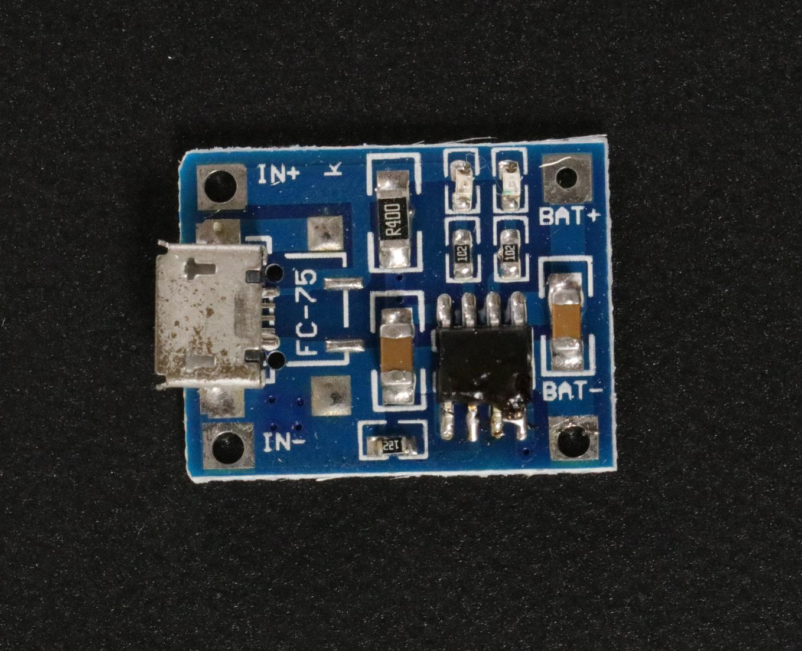 | 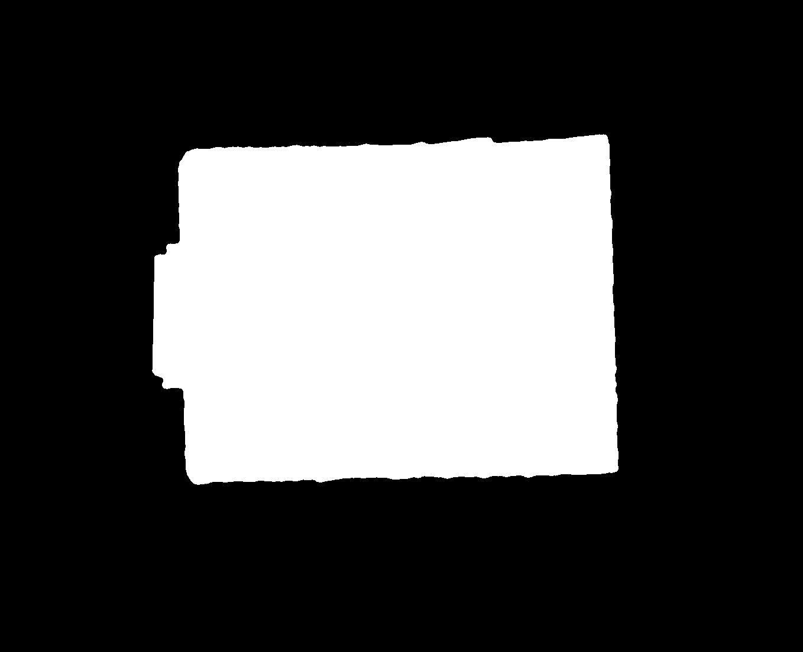 | 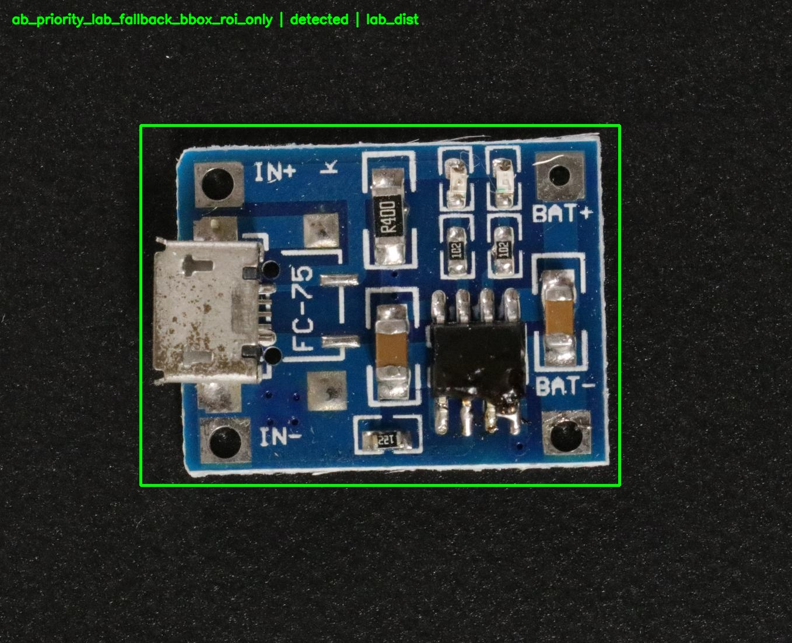 |

Additional debug maps used during ROI selection:

| AB Distance | LAB Distance |
| --- | --- |
| 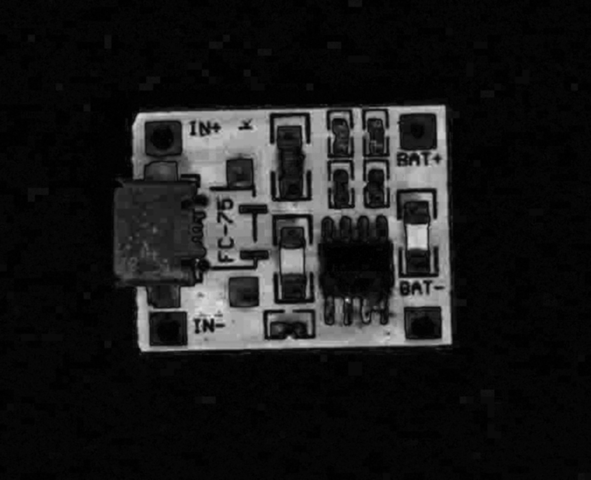 | 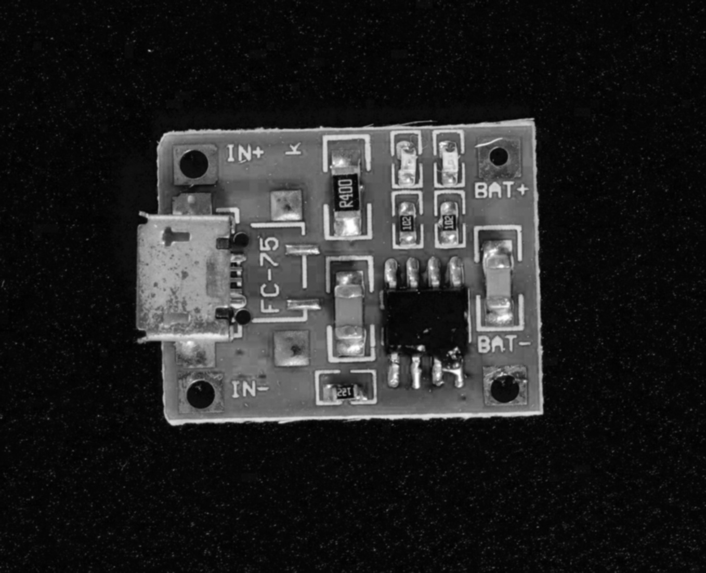 |

### 6-2. cashew ROI Example

| Raw | Foreground | ROI Debug |
| --- | --- | --- |
| 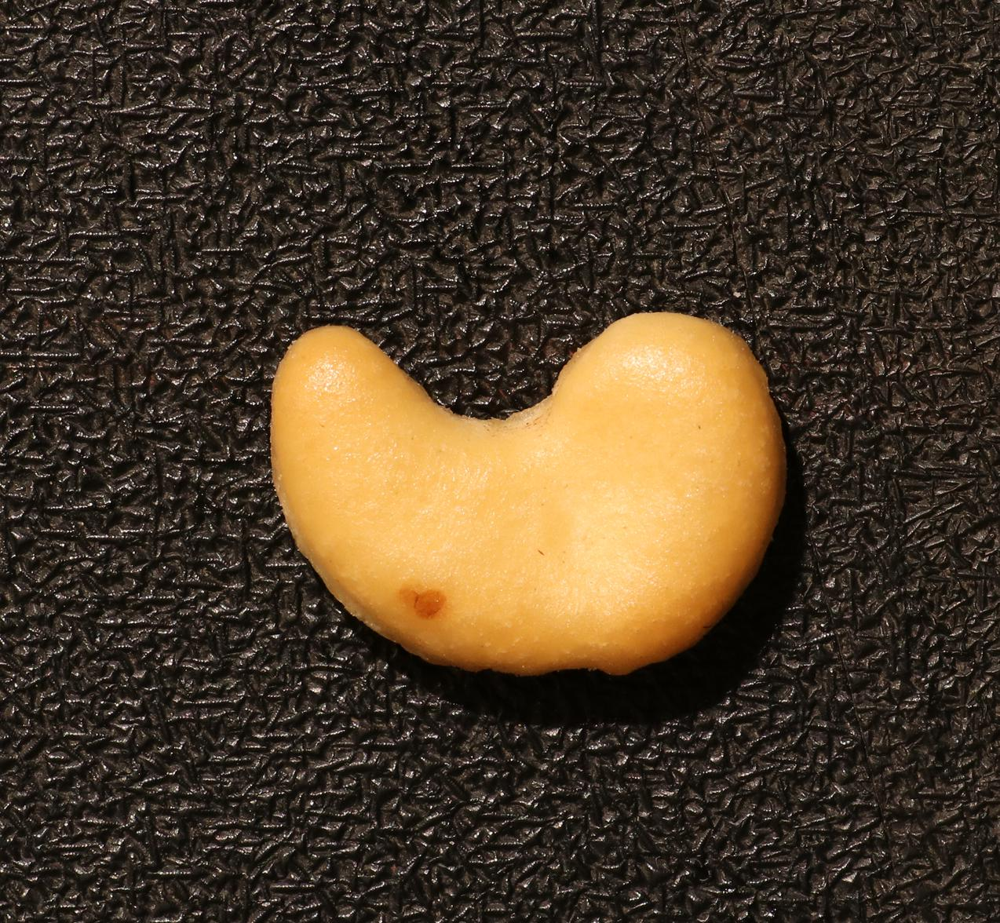 | 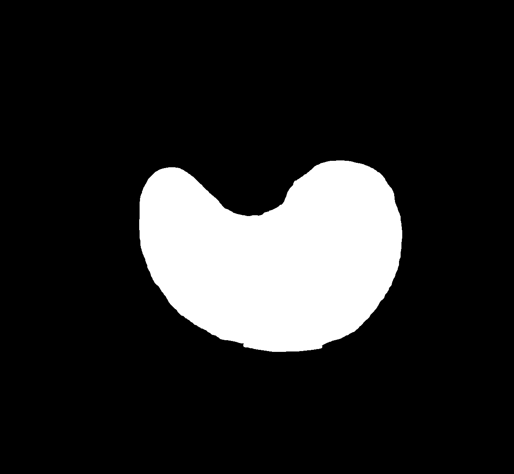 | 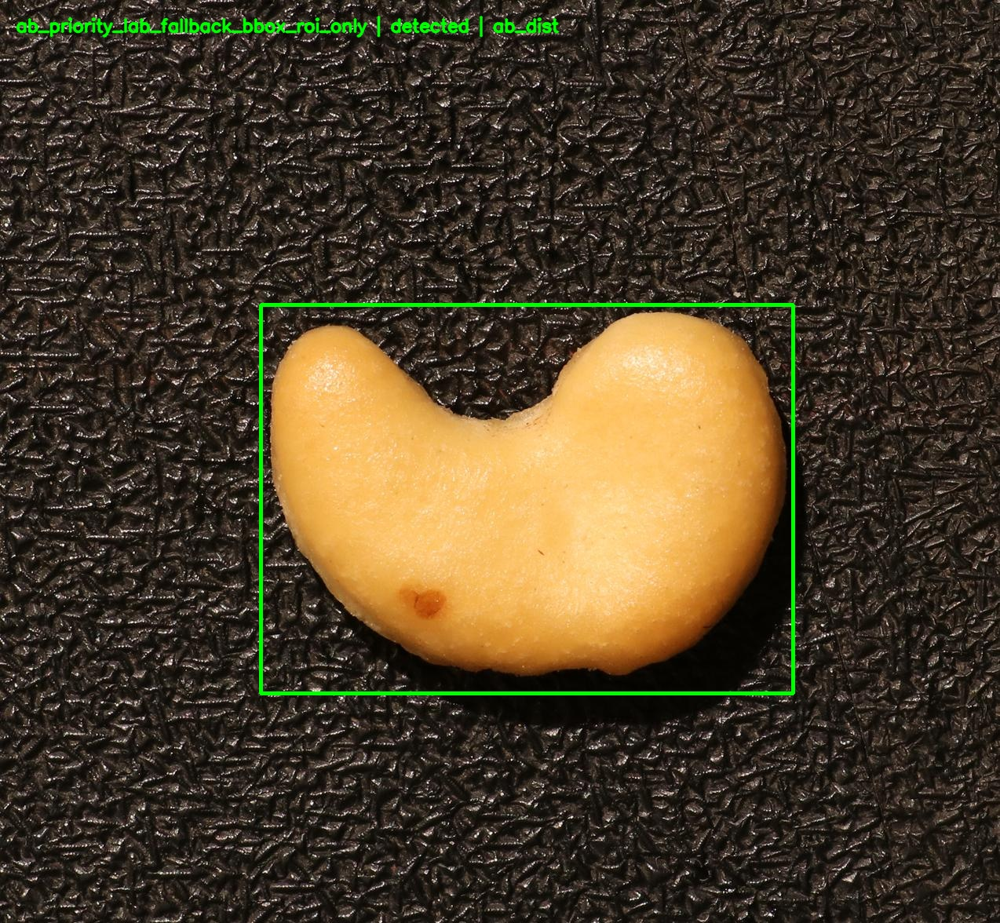 |

Additional debug maps used during ROI selection:

| AB Distance | LAB Distance |
| --- | --- |
| 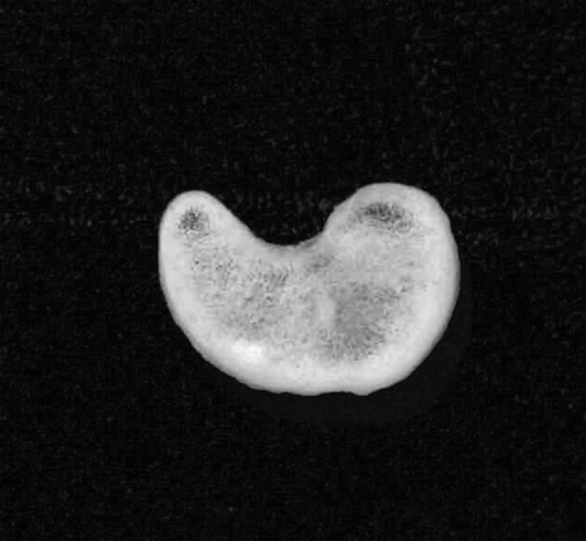 | 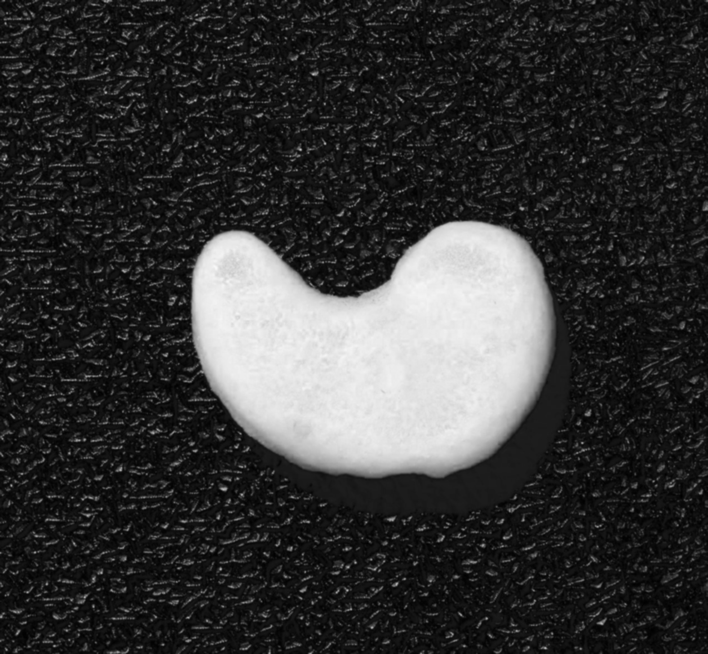 |

### 6-3. ROI Baseline Output

The ROI-only output is used as the baseline model input for the later stages.

- `data/processed/pcb4/...`
- `data/processed/cashew/...`

---

## 7. Preprocessing Comparison Plan

After establishing the ROI-only baseline, the next step was to compare whether additional contrast enhancement would improve anomaly separation in a meaningful way.

### 7-1. Comparison Versions

| Version | Preprocessing |
| ------- | ------------- |
| V1 | ROI / Crop + Resize / Normalize |
| V2 | ROI / Crop + Resize / Normalize + CLAHE |

### 7-2. Why CLAHE Was Compared

CLAHE can enhance local texture and weak patterns, but it does not always improve anomaly detection performance. In some cases, contrast enhancement can also amplify normal texture and make score distributions less stable.

For that reason, this project did not treat CLAHE as a fixed default preprocessing step. Instead, it was evaluated as an experimental variable against the ROI-only baseline.

### 7-3. What Was Compared

The comparison focused on the following items:

- anomaly score distribution
- threshold differences
- representative heatmap / overlay behavior
- false positive cases
- false negative cases

---

## 8. Project Pipeline

```text
Raw Image
  -> ROI / Crop
  -> Resize / Normalize
  -> Patch Memory-Bank Anomaly Detection
  -> Score / Heatmap / Overlay
  -> Threshold-based Decision
  -> FP/FN Analysis
  -> CLAHE On/Off Comparison
  -> Filter Extension Experiments
  -> Final Operating Threshold
  -> Drift Monitoring / Retrain Trigger
  -> FastAPI Response
  -> MFC Demo Client
```
---

## 9. Directory Structure
```text
Production-Vision-Inspection/
├─ README.md
├─ configs/      # threshold and operating configuration files
├─ docs/         # figures, comparison images, and portfolio assets
├─ mfc_demo/     # MFC-based Windows demo client
└─ src/          # preprocessing, inference, API, analysis, training, and monitoring code
```
## 10. CLAHE Comparison

### 10-1. Why This Comparison Matters

After fixing the ROI-only baseline, the next question was whether CLAHE would improve anomaly separation under the same ROI condition.

The purpose of this comparison was to verify:

- whether local contrast enhancement helps anomaly score separation
- whether heatmap / overlay interpretation becomes clearer
- whether FP and FN cases are reduced
- whether CLAHE is actually beneficial from an inspection-operation perspective

### 10-2. Comparison Setting

In this experiment, the ROI was kept identical and only CLAHE application was changed.

| Version | Preprocessing |
| ------- | ------------- |
| V1 | ROI / Crop + Resize / Normalize |
| V2 | ROI / Crop + Resize / Normalize + CLAHE |

The comparison rules were:

- the same ROI bbox was used for both versions
- the same model and threshold-search logic were used
- the only input difference was whether CLAHE was applied
- thresholds were calculated separately for each version and category
- the initial comparison threshold was selected using the best F1 point

### 10-3. Input Example Comparison

#### pcb4 Input Example
| ROI-only | ROI + CLAHE |
| --- | --- |
| 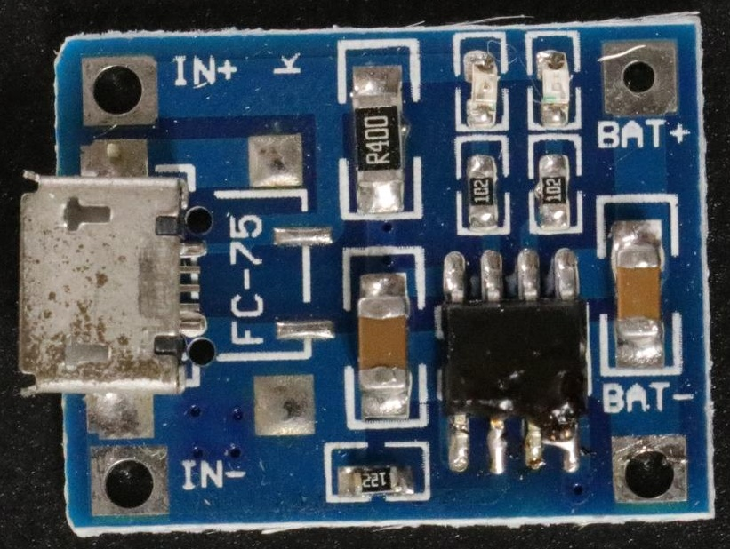 | 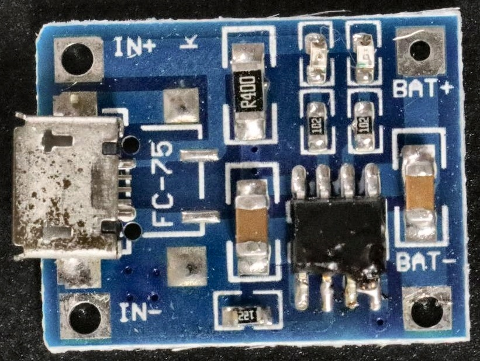 |

#### cashew Input Example
| ROI-only | ROI + CLAHE |
| --- | --- |
| 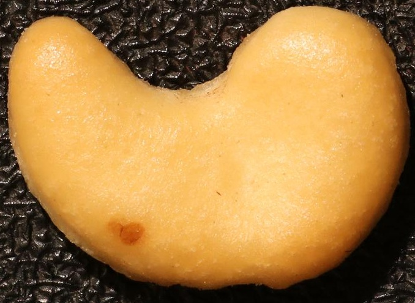 | 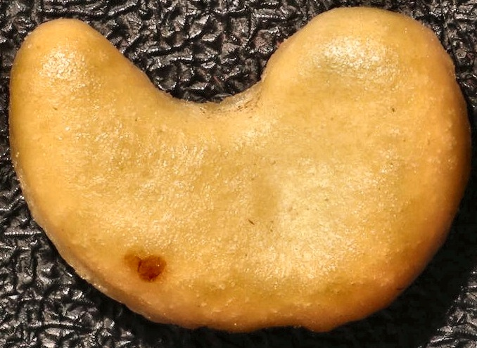 |

### 10-4. Quantitative Comparison

#### Category-wise Summary

| Category | Version | Image-level AUROC | Best Threshold | Precision | Recall | F1 |
| -------- | ------- | ----------------: | -------------: | --------: | -----: | --: |
| pcb4 | ROI-only | 0.9700 | 0.0756 | 0.7975 | 0.63 | 0.7039 |
| pcb4 | ROI+CLAHE | 0.9748 | 0.0808 | 0.7931 | 0.69 | 0.7380 |
| cashew | ROI-only | 0.9695 | 0.0554 | 0.7611 | 0.86 | 0.8075 |
| cashew | ROI+CLAHE | 0.9533 | 0.0577 | 0.7217 | 0.83 | 0.7721 |

#### Score Distribution Comparison

| Category | Version | Observation |
| -------- | ------- | ----------- |
| pcb4 | ROI-only | Good normal/anomaly separation overall, but false negatives were relatively high. |
| pcb4 | ROI+CLAHE | CLAHE raised anomaly scores more effectively on weak defects, improving Recall and F1. |
| cashew | ROI-only | Score separation was the most stable and gave the best overall metrics. |
| cashew | ROI+CLAHE | CLAHE also increased responses on normal surface texture, slightly degrading separation. |

#### Score Histogram

##### pcb4

| ROI-only | ROI+CLAHE |
| --- | --- |
| 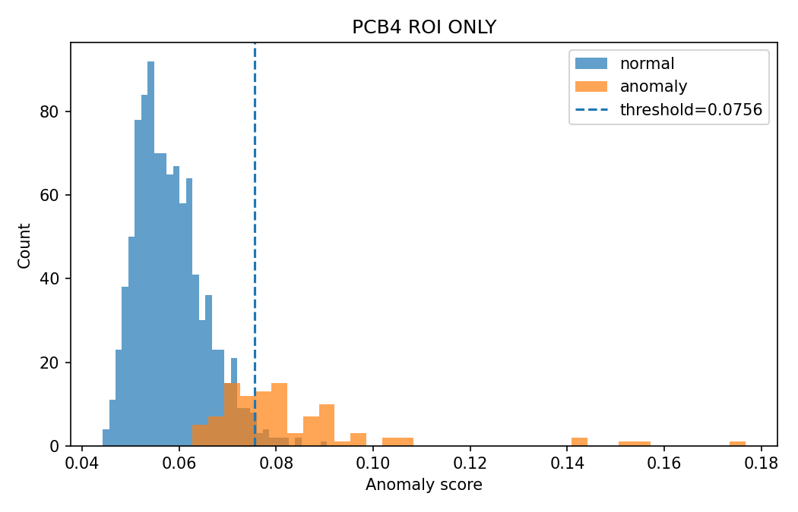 | 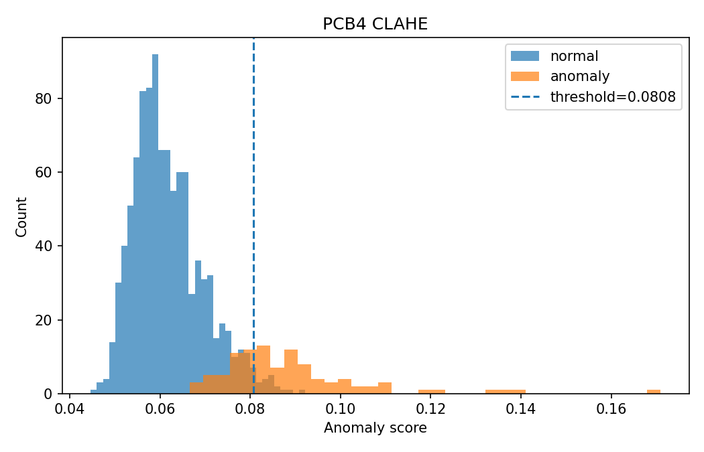 |

##### cashew

| ROI-only | ROI+CLAHE |
| --- | --- |
| 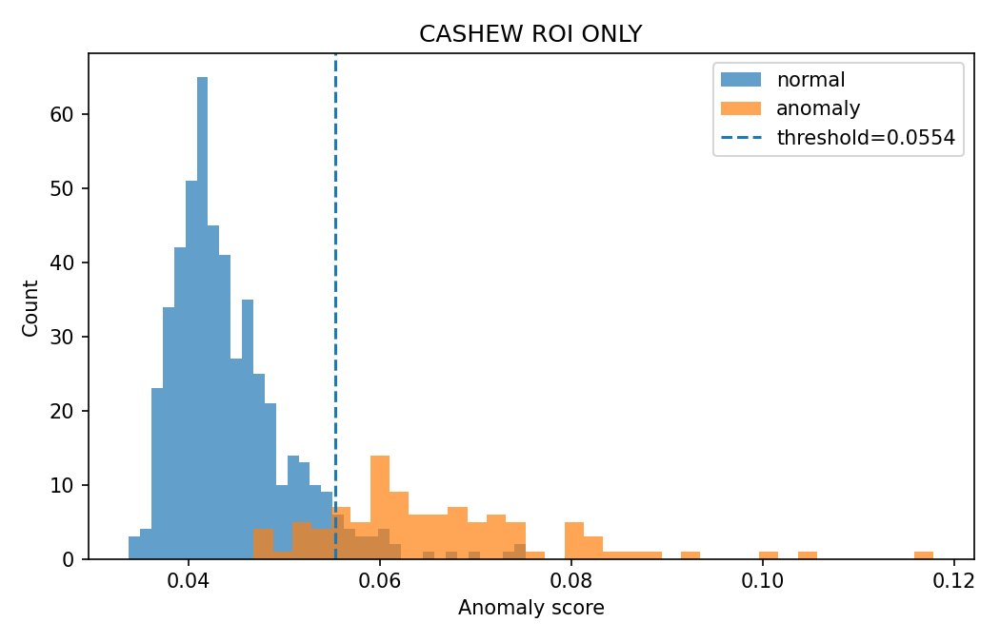 | 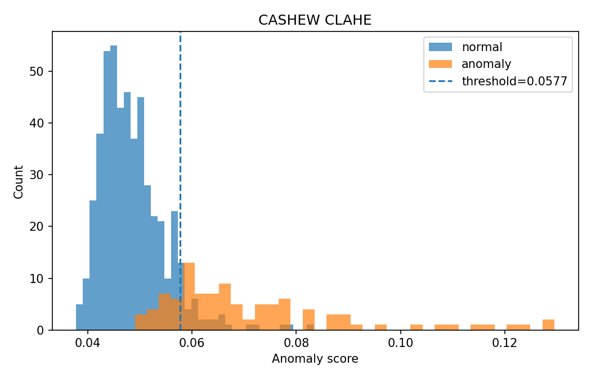 |

### 10-5. Threshold Comparison

Threshold behavior matters because operation quality depends not only on score separation itself, but also on how FP and FN change after the threshold is applied.

| Category | Version | Threshold | TP | TN | FP | FN | Comment |
| -------- | ------- | --------: | --: | --: | --: | --: | ------- |
| pcb4 | ROI-only | 0.0756 | 63 | 989 | 16 | 37 | FP was low, but FN remained too high for practical defect screening. |
| pcb4 | ROI+CLAHE | 0.0808 | 69 | 987 | 18 | 31 | FP increased slightly, but FN decreased enough to make the overall balance better. |
| cashew | ROI-only | 0.0554 | 86 | 473 | 27 | 14 | This was the most stable combination overall and gave the best defect detection quality. |
| cashew | ROI+CLAHE | 0.0577 | 83 | 468 | 32 | 17 | CLAHE slightly worsened both FP and FN on this category. |

### 10-6. Qualitative Comparison

Representative images were not selected randomly.  
They were chosen from the **same samples whose prediction actually changed depending on the preprocessing version**.

#### pcb4 — Success Case  
`anomaly/images/070.jpg`

This is a case where ROI-only missed the defect, while ROI+CLAHE changed the result to a true positive by strengthening local defect texture contrast around the connector region.

##### Overlay

| Original | ROI-only | ROI+CLAHE |
| --- | --- | --- |
| 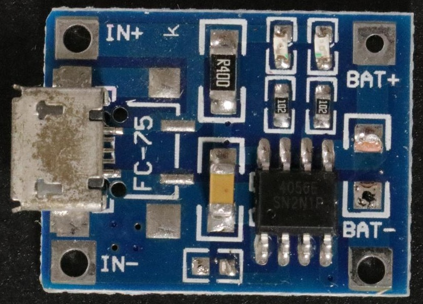 | 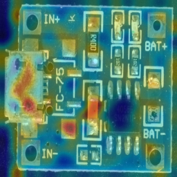 | 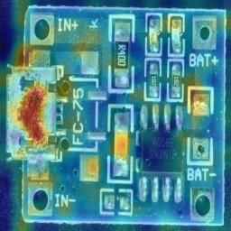 |

##### Heatmap

| Original | ROI-only | ROI+CLAHE |
| --- | --- | --- |
|  | 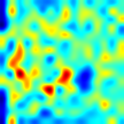 | 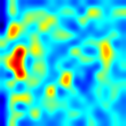 |

#### pcb4 — Failure Case  
`normal/images/0867.jpg`

This is a case where CLAHE emphasized normal structural edges, metallic reflections, and connector regions together, producing a false positive.

##### Overlay

| Original | ROI-only | ROI+CLAHE |
| --- | --- | --- |
| 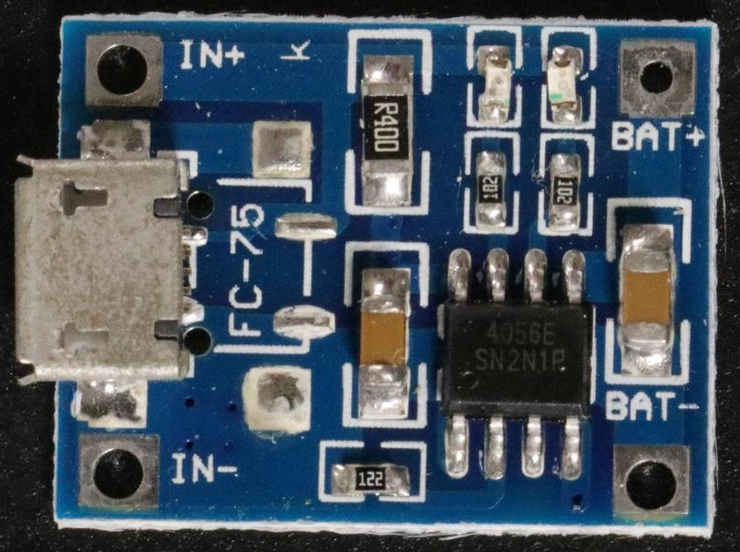 | 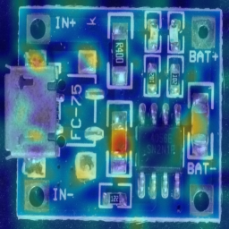 | 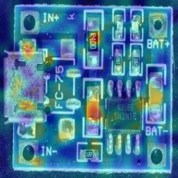 |

##### Heatmap

| Original | ROI-only | ROI+CLAHE |
| --- | --- | --- |
|  | 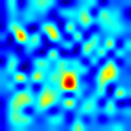 | 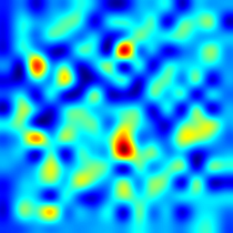 |

#### cashew — Success Case  
`anomaly/images/089.jpg`

ROI-only responded more locally to the actual defect region, while ROI+CLAHE increased background-boundary and surface-texture responses, eventually changing the result in the wrong direction.

##### Overlay

| Original | ROI-only | ROI+CLAHE |
| --- | --- | --- |
| 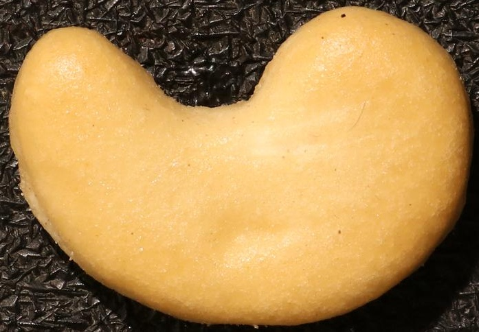 | 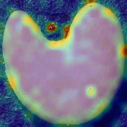 | 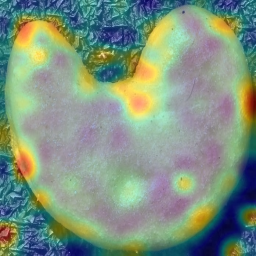 |

##### Heatmap

| Original | ROI-only | ROI+CLAHE |
| --- | --- | --- |
|  | 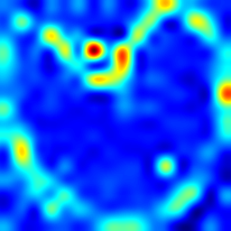 | 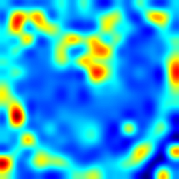 |

#### cashew — Failure Case  
`normal/images/361.jpg`

This is a case where CLAHE over-emphasized normal grain texture and illumination unevenness, changing a true negative into a false positive.

##### Overlay

| Original | ROI-only | ROI+CLAHE |
| --- | --- | --- |
| 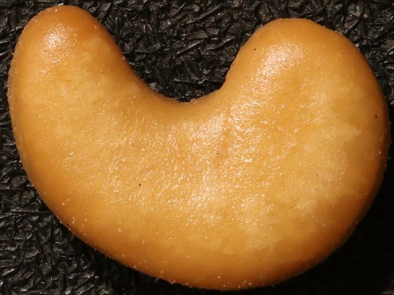 | 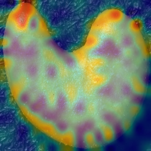 | 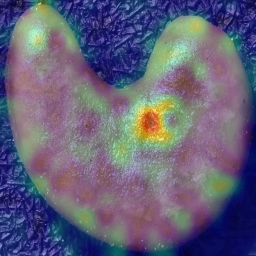 |

##### Heatmap

| Original | ROI-only | ROI+CLAHE |
| --- | --- | --- |
|  | 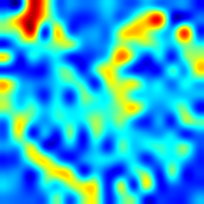 | 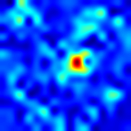 |

### 10-7. FP / FN Case Comparison

#### FP/FN Top5 Tables

- `docs/clahe_compare/fp_fn_top5/pcb4_roi_only_fp_top5.csv`
- `docs/clahe_compare/fp_fn_top5/pcb4_roi_only_fn_top5.csv`
- `docs/clahe_compare/fp_fn_top5/pcb4_clahe_fp_top5.csv`
- `docs/clahe_compare/fp_fn_top5/pcb4_clahe_fn_top5.csv`
- `docs/clahe_compare/fp_fn_top5/cashew_roi_only_fp_top5.csv`
- `docs/clahe_compare/fp_fn_top5/cashew_roi_only_fn_top5.csv`
- `docs/clahe_compare/fp_fn_top5/cashew_clahe_fp_top5.csv`
- `docs/clahe_compare/fp_fn_top5/cashew_clahe_fn_top5.csv`

#### Failure Mode Summary

- **pcb4 FP**: Normal structural edges, silk-print regions, metallic pads, and reflective components are likely to be emphasized as anomaly-like responses.
- **pcb4 FN**: In the ROI-only version, weak defects or highly localized defect signals can remain below the threshold.
- **cashew FP**: Normal grain texture, gloss, and illumination unevenness are likely to be interpreted as anomalies.
- **cashew FN**: In the CLAHE version, surrounding texture and boundary responses can be over-emphasized, making the true defect signal less localized.

#### Gallery Assets

- `docs/images/clahe_compare/gallery/pcb4_roi_only_fp_*.png`
- `docs/images/clahe_compare/gallery/pcb4_roi_only_fn_*.png`
- `docs/images/clahe_compare/gallery/pcb4_clahe_fp_*.png`
- `docs/images/clahe_compare/gallery/pcb4_clahe_fn_*.png`
- `docs/images/clahe_compare/gallery/cashew_roi_only_fp_*.png`
- `docs/images/clahe_compare/gallery/cashew_roi_only_fn_*.png`
- `docs/images/clahe_compare/gallery/cashew_clahe_fp_*.png`
- `docs/images/clahe_compare/gallery/cashew_clahe_fn_*.png`

### 10-8. Interpretation

CLAHE can make fine patterns more visible, but it is not always beneficial for anomaly detection.

- For `pcb4`, CLAHE was more useful because it strengthened weak defect contrast and improved recall and F1.
- For `cashew`, ROI-only remained more stable because CLAHE also amplified normal texture and noise, which degraded score separation.

### 10-9. Result Summary

#### Summary Table

| Category | Better Version | Reason |
| -------- | -------------- | ------ |
| pcb4 | ROI+CLAHE | Recall and F1 improved, and the representative cases showed stronger responses on weak defect regions. |
| cashew | ROI-only | AUROC, Precision, Recall, and F1 were all more stable without CLAHE. |

#### Final Decision Table

| Category | ROI-only | ROI+CLAHE | Selected Version | Note |
| -------- | -------: | --------: | ---------------- | ---- |
| pcb4 | F1 0.7039 / AUROC 0.9700 | F1 0.7380 / AUROC 0.9748 | ROI+CLAHE | The reduction in false negatives was more meaningful than the increase in false positives. |
| cashew | F1 0.8075 / AUROC 0.9695 | F1 0.7721 / AUROC 0.9533 | ROI-only | CLAHE amplified texture and noise, which degraded overall separation. |

### 10-10. Practical Takeaway

This comparison showed that input preprocessing should not be chosen simply to increase contrast.  
Instead, it should be selected in a way that produces a more stable score distribution and more interpretable inspection results in operation.

In this project, CLAHE was not treated as a default improvement technique.  
It was evaluated as an optional preprocessing method whose effect had to be verified against the ROI-only baseline.

- For `pcb4`, CLAHE was beneficial because it improved weak defect contrast.
- For `cashew`, ROI-only was more stable, while CLAHE amplified benign texture and noise.
- Therefore, preprocessing should be applied selectively depending on category-specific texture characteristics.

## 11. Extension Filter Experiments

### 11-1. Why Additional Experiments Were Needed

Even after the CLAHE comparison, the number of false positives was still not low enough for practical operation under the operating-threshold setting.

Instead of redesigning the entire preprocessing pipeline, this project ran extension experiments by adding only one lightweight filter on top of the selected preprocessing version for each category.

The goals were:

- for `pcb4`, reduce structural edges and reflective hotspots while preserving defect contrast
- for `cashew`, reduce false positives caused by surface grain texture and brightness variation

### 11-2. Experiment Matrix

#### pcb4 (base version: ROI+CLAHE)

- `CLAHE + MedianBlur(3x3)`
- `CLAHE + GaussianBlur(3x3)`
- `CLAHE + MedianBlur(5x5)`
- `CLAHE + BilateralFilter`

#### cashew (base version: ROI-only)

- `ROI-only + MedianBlur(3x3)`
- `ROI-only + BilateralFilter`
- `ROI-only + GaussianBlur(3x3)`
- `ROI-only + MedianBlur(5x5)`

Mask gating was also tested, but it significantly degraded performance on both categories and was excluded from the final candidates.

### 11-3. Key Results

#### pcb4

- `CLAHE + Median3` was the most stable option with **F1 0.75**, **FP 25**, and **FN 25**.
- `CLAHE + Gaussian3` reached **F1 0.73**, **FP 27**, and **FN 27**, which was worse than `Median3`.
- `CLAHE + Median5` reached **F1 0.7363**, **FP 27**, and **FN 26`, but did not outperform `Median3`.
- `CLAHE + Bilateral` reduced FP to **19**, but FN increased to **30**, so it was not selected under a defect-leakage-minimization perspective.

#### cashew

- `ROI-only + Median3` produced **F1 0.8125**, **FP 14**, and **FN 22**.
- `ROI-only + Gaussian3` produced **F1 0.8144**, **FP 15**, and **FN 21**, making it the strongest balanced candidate.
- `ROI-only + Median5` still achieved **Recall 0.90** and **FN 10** at the F1-based threshold, making it the most favorable high-recall operating candidate.
- `ROI-only + Bilateral` did not clearly outperform the median-based variants.

### 11-4. Final Decision from Extension Experiments

| Category | Selected Candidate | Reason |
| --- | --- | --- |
| pcb4 | `CLAHE + Median3` | Best overall stability in F1 / FP / FN balance |
| cashew | `ROI-only + Median5` | Most favorable candidate for high-recall operation |

### 11-5. Practical Takeaway

These extension experiments showed that the best operating preprocessing should not be selected only by the highest balanced metric.

- For `pcb4`, `CLAHE + Median3` was selected because it kept a practical balance while preserving defect sensitivity.
- For `cashew`, `ROI-only + Median5` was selected because it was more favorable under a high-recall operating policy, even though `Gaussian3` was a strong balanced candidate.
- Therefore, the final operating version should be chosen according to the target operation policy, not only according to a single offline metric.

## 12. Final Operating Threshold Reconfiguration

### 12-1. Why the Threshold Was Reconfigured

The CLAHE comparison and extension filter experiments were compared fairly using F1-optimal thresholds.

After the final operating candidates were selected, the threshold policy was reconfigured from an operational perspective. In inspection settings, missing a defective sample is usually more costly than reviewing an additional false alarm.

For that reason, the threshold policy was split into two stages:

1. **comparison stage**: F1-optimal threshold
2. **operation stage**: recall-priority threshold

### 12-2. Final Selected Version

| Category | Final Selected Version | Reason |
| --- | --- | --- |
| pcb4 | CLAHE + Median3 | It showed the most stable F1 / FP / FN balance among the extension experiments, and the recall-0.90 operating point was practical. |
| cashew | ROI-only + Median5 | In the high-recall sweep, it achieved a similar FN level with fewer FP than Gaussian3. |

### 12-3. Final Operating Threshold Policy

- `pcb4`: Recall `>= 0.90`
- `cashew`: Recall `>= 0.95`

Among the thresholds satisfying the target recall, the final threshold was selected to avoid unnecessary score relaxation while still preserving the recall target.

### 12-4. Final Operating Threshold Result

| Category | Version | Selection Rule | Threshold | Precision | Recall | TP | TN | FP | FN | AUROC |
| --- | --- | --- | ---: | ---: | ---: | ---: | ---: | ---: | ---: | ---: |
| pcb4 | CLAHE + Median3 | Recall-priority (>= 0.90) | 0.0750242769 | 0.5882 | 0.9000 | 90 | 942 | 63 | 10 | 0.9750 |
| cashew | ROI-only + Median5 | Recall-priority (>= 0.95 target) | 0.0498208888 | 0.6573 | 0.9400 | 94 | 451 | 49 | 6 | 0.96976 |

### 12-5. Comparison with F1-Optimal Threshold

| Category | Version | Threshold Type | Threshold | Precision | Recall | FP | FN |
| --- | --- | --- | ---: | ---: | ---: | ---: | ---: |
| pcb4 | CLAHE + Median3 | F1-optimal | 0.0790273696 | 0.7500 | 0.7500 | 25 | 25 |
| pcb4 | CLAHE + Median3 | Recall-priority | 0.0750242769 | 0.5882 | 0.9000 | 63 | 10 |
| cashew | ROI-only + Median5 | F1-optimal | 0.0516819507 | 0.7258 | 0.9000 | 34 | 10 |
| cashew | ROI-only + Median5 | Recall-priority | 0.0498208888 | 0.6573 | 0.9400 | 49 | 6 |

### 12-6. Practical Interpretation

The recall-priority operating point substantially reduced false negatives for both categories.

- For `pcb4`, false negatives decreased from `25` to `10`, while false positives increased from `25` to `63`.
- For `cashew`, false negatives decreased from `10` to `6`, while false positives increased from `34` to `49`.

This trade-off is acceptable when the downstream process includes manual review or secondary inspection, because defect leakage is treated as more critical than additional alarm volume.

### 12-7. Operational Takeaway

This project separates the threshold policy into two stages:

1. **Comparison threshold**  
   F1-optimal threshold used for fair preprocessing comparison.

2. **Operating threshold**  
   Recall-priority threshold used to reduce defect leakage in a practical inspection workflow.

This separation reflects a more realistic industrial setup: the model is evaluated fairly during comparison, but deployed conservatively during operation.

